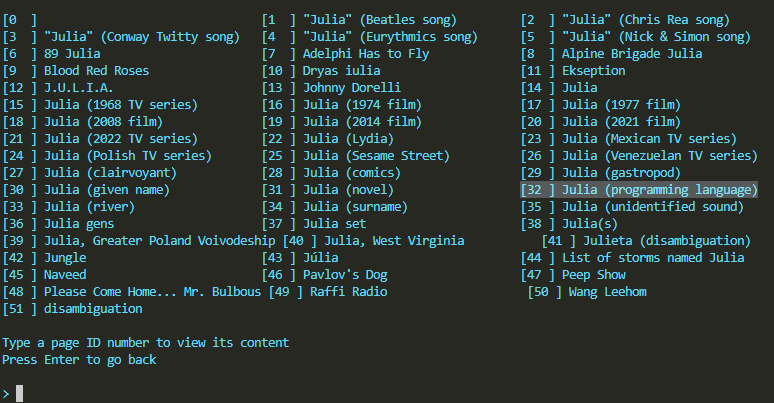
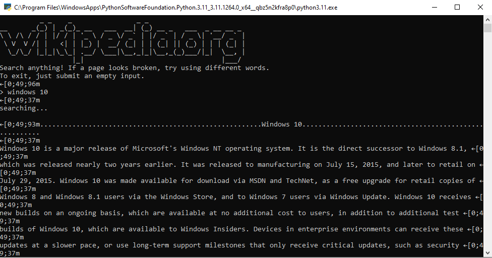

# Wikipedia scraper for python

This is primarily a tool for reading wikipedia articles from the terminal. More functionality coming soon, probably.

## Searching for articles
The way the searching works is just like it would on the wikipedia search bar. Sometimes multiple things have the same term and different people have the same name. When the website isn't sure which you mean, it will show you possible options.

You can try to make it more specific, for example **python** could mean snakes, people and many other things. But typing **python language** takes you to the Python (Programming Language) page. Or you can simply type python to go to the disambiguation page and list all the links on it in order to go where you want to, like this:

## Color scheme
The colors for each HTML tag are stored in variables that you can change. Depending on the theme you're using on your terminal, color and color name may mismatch, but most of the time it's the same, e.g ´YELLOW´ is in fact yellow.

**This feature is not compatible with the Windows terminal!** That's how it looks like:

